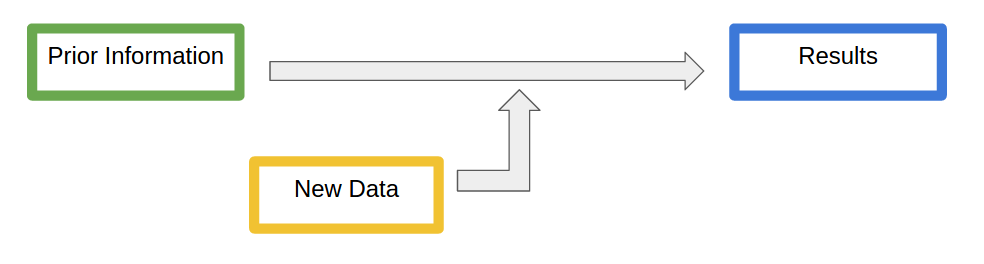

# Overview of Bayesian Reliability Analysis

The key idea behind bayesian inference is taking your current knowledge about an event or process, and then collecting data about it in order to form an updated opinion.  The goal of these applications is to help you understand and visualize this process for different types of reliability problems.
<br>

<br>

# Types of Analysis

Understanding the question of interest the key first step in any Bayesian statistical analysis. 
<br>
Some questions you should ask are:

* What is the variable of interest? 
* What values can it take?

<br>
The answers to these questions will determine what type of model is appropriate.
<br>
**Example 1:**   Probability of Failure
<br>
We will be stress testing a new type of pipe.  We are interested the probability a pipe will pass the stress test.  We know that probabilities take values between zero and one.  This will lead us to a Beta-Binomial model for our analysis.
<br>
**Example 2:**  Average Time to Failure
<br>
Now we will be testing how long the new pipes will last.  We are interested in the average time the new type of pipe will last before it fails.  We know that this average will take a positive real number value.  This will lead us to an Exponential-Gamma model for our analysis.

<br>
<br>

# Prior Information

The next step is organizing any prior information or knowledge you have about the variable of interest (ideally this is done before any data is collected).  We will represent this information with a probability distribution function.  The form of this function will depend on the type of model we have selected.

## Probability Distribution Functions

The graphs of these functions are the primary way we will visualize our prior beliefs and our updated beliefs about the variable of interest.  Using these mini apps you can see how the parameters change the graph of the distributions.  Using the mean and variance formulas you should be able to manipulate alpha and beta parameters to achieve a distribution with the center and amount of spread you want.

### Beta

$$ f(x|\alpha, \beta) \propto x^{\alpha - 1} (1-x)^{\beta -1} $$ 
```{r, echo = FALSE, warning=FALSE}
library(shiny)
library(ggplot2)
shinyApp(
  
  ui = shinyUI(fluidPage(
  
  column(12,
         ""),
  
  sidebarLayout(
    sidebarPanel(
    
      sliderInput("a", 
                  "Alpha:", 
                  value = 1,
                  min = .01, 
                  max = 10),
      sliderInput("b", 
                  "Beta:", 
                  value = 1,
                  min = 0.01, 
                  max = 10)
    ),
    mainPanel(
        plotOutput('plot1'),
        textOutput("summary")
    )
  )
)),
  
  server = function(input, output) {
  
  data1 <- reactiveValues()
  
  plot <- function(a,b){
    x <- seq(0.01,0.99,0.01)
    betaD <- dbeta(x,a,b)

    data1$beta <- data.frame(cbind(x, betaD))
    
    ggplot(data1$beta, aes(x=x, y=betaD)) + geom_line(colour="#CC0000") + ylab("Density")
    
  }  
  
  output$plot1 <- renderPlot({
    plot(input$a,input$b)
  })
  
  output$summary <- renderPrint({
    m <- input$a / (input$a + input$b)
    paste("Mean:", m)

  })

},
     options = list(height = 600)
)
```


### Gamma


$$ f(x|\alpha, \beta) \propto x^{\alpha - 1} e^{-\beta x} $$ 

```{r, echo = FALSE, warning=FALSE}
library(shiny)
library(ggplot2)
shinyApp(
  
  ui = shinyUI(fluidPage(
  
  column(12,
         ""),
  
  sidebarLayout(
    sidebarPanel(
    
      sliderInput("a", 
                  "Alpha:", 
                  value = 5,
                  min = .01, 
                  max = 10),
      sliderInput("b", 
                  "Beta:", 
                  value = 5,
                  min = 0.01, 
                  max = 10)
    ),
    mainPanel(
        plotOutput('plot1'),
        textOutput("summary")
    )
  )
)),
  
  server = function(input, output) {
  
  plot <- function(a,b){
    x <- seq(0, 10, 0.01)
    gammaD <- dgamma(x,a,b)

    d <- data.frame(cbind(x, gammaD))
    
    ggplot(d, aes(x=x, y=gammaD)) + geom_line(colour="#CC0000") + ylab("Density") +  coord_cartesian(xlim = c(0, 10)) + theme(axis.text.x = element_text(colour = "blue", size = 15, face = "italic"))
    
  }  
  
  output$plot1 <- renderPlot({
    plot(input$a,input$b)
  })
  
  output$summary <- renderPrint({
    m <- input$a / input$b
    paste("Mean:", m)

  })
},
  
  options = list(height = 600)
)
```


## Uninformative

A common case will be when we have no prior information or knowledge about the variable of interest.  In this case we will want to use an uninformative prior distribution.

## Informative

We will build an informative prior when we have any form of prior information or knowledge that we want to incorporate into the analysis.  Prior information can come in many different forms.  The main thing to keep in mind when building an informative prior is that you will need to have justification for using it.

Examples of Prior Information:

* Data from similar experiments
* Expertise in the field
* Natural Limitations

The impact of an informative prior will be relative to the amount of data collected.
<br>
**Example 1:**   Probability of Failure 
<br>
In our stress test example, we might have done a similar test with a different type of pipe.  We can use the data from this test to build an informative prior.  Even though we have prior data we will still need to use our own judgement on how impactful our prior should be.  This could depend on how similar the two types of pipes are or how recent the study was conducted
<br>

*(Include real numbers for the example)*
<br>
**Example 2:**  Average Time to Failure
<br>
In our time to failure example with the pipe, we might not have any prior information, or we might not be very confident in any information we have.  In this case we will use an uninformative prior.

*(Choose prior to use for the example)*
<br

# New Data

After choosing the model and building the prior distribution, we will now incorporate the new data that has been collected.  We will be representing it with a likelihood function.  The form of this likelihood function also depends on the type of model we have selected.

## Likelihood Function

The graphs of these functions will give us a way to visualize the information given by the data on a comparable scale to our prior information.  Although likelihood functions are not the same as distributions our applications will allow you to compare them on an appropriate scale.

**Example 1:**   Probability of Failure

*(numeric examples and discussion about acceptable input types for the apps)*

<br>

**Example 2:**  Average Time to Failure

<br>

# Posterior (Results)

Our results will be a combination of our prior knowledge and the collected data.  This, like the prior, will be represented with a probability distribution function.  This resulting distribution represents our updated beliefs about the variable of interest. 

<br>

## Summary Statistics

From the posterior distribution we are able to calculate useful summary statistics, such as the mean and standard deviation. 

<br>

## Credible Interval

Another useful measurement from the posterior distribution is a credible interval.  Here we can state an interval that we expect a high percentage of the probability to fall (usually 90% or 95%).

<br>
**Example 1:**   Probability of Failure
*(example that matches the others and discussion about interpretations)*

<br>

**Example 2:**  Average Time to Failure
*example that matches*

<br>
Important to remember the posterior represents our beliefs about the average failure time, not an individual observation.  In other words we might be very confident the average failure time is between 70 and 80, but this does not necessarily mean we expect a single observation to fall in this range with a high level of confidence. 
